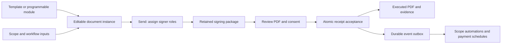

# Document signing architecture and implementation record

Implemented locally September 26, 2026. No production activation was performed.
This supersedes the implementation findings in the [initial review](../esignature-review-2026-09-26.md), which remains historical evidence of the original defects.

## Preserve composition; make acceptance authoritative

Templates, document workflows, scope automations and bounded modules still create ordinary document instances. Authors can compose arbitrary document content, resolve project data and pricing, and inject `doc.signature` widgets. A separate signing package owns the reviewed record, signer assignments, consent, accepted receipts and executed PDF. A signature-shaped value in document outputs is not authority to execute a contract or complete a signature step.



The implementation lives in `public/v1/documents/signing/{model,store,service}.ts`. All document writes pass through the storage guard, including direct domain adapters. Receipts prohibit changes to contract source or accepted signature values even after voiding. A new agreement or amendment is the way to change accepted terms.

## Fields, roles and placement

Field keys identify acts of signing; placement is separate. Output definitions can declare `type: "signature"`, `signer_id`, `signer`, `required`, `required_for` and `signing_order`. The legacy party names `internal` and `company` resolve to company. Every required role needs an email invitation or an assigned organization user. Recipient records support `signer_id`, `name`, `email`, `user_id`, `order` and `capacity`.

Example widget configuration for two signers in one signature area:

```json
{
  "output_keys": ["owner_signature", "co_owner_signature"],
  "signer_ids": ["owner", "co_owner"],
  "required": true
}
```

Each field has an independent receipt. Shared-position widgets lay out separate signature lines; they do not paint one person's signature over another. Repeated placements with the same output key represent the same accepted field. Separate overlapping fields or fields outside the page fail signing preparation. Workflow-only fields without a page placement are associated with the retained agreement and appear in the appended signature record.

Roles may use the same email address without being merged. Duplicate recipients ambiguously assigned to one role are rejected. Signing order is explicit: equal orders can sign in parallel; earlier required roles gate later ones. Up to 50 roles are supported. Required fields control completion; optional fields may be signed while the package is open, but do not hold it open after all required fields finish. An all-optional package completes only when all its fields are signed. Unassigned optional roles receive no invitation.

## Issuance and acceptance

1. **Create and configure.** Signature widgets infer output requirements even when e-signing is disabled. Disabled capability means signing is unavailable, not that required signatures disappear.
2. **Send.** Validate assignments and a real signing-support/paper-copy contact before creating the package. Individual invitations contain random 256-bit bearer tokens; the signing store retains their SHA-256 hashes. Shared document links cannot sign. Account-assigned roles require that user's authenticated session and `sign_documents` permission. Issuing requires `issue_documents`.
3. **Prepare.** Resolve the current document, retained module result, prices and bindings; render the review PDF in strict mode. Retain the exact PDF, rendering inputs/harness, placements, signer plan, disclosure and hashes. A per-role challenge expires after 30 minutes. Changed unsigned source invalidates the previous challenge/content version; changed assignments require reissuance.
4. **Review and consent.** The widget downloads and validates the PDF response before enabling the access confirmation. The signer confirms intent, electronic records and ability to access/retain the PDF. The disclosure identifies the particular agreement, paper-copy and withdrawal contact, access requirements and scope of consent. Decline/request-paper closes the package and emits `document.declined`; contacting the issuer handles later consent-withdrawal requests.
5. **Accept.** Revalidate active status, expiry, current snapshot, assignments, routing, capability, content hash, challenge and consent on the server. Typed names are bounded; drawn signatures must decode to nonempty PNGs with size/pixel limits. Client timestamps and claimed audit metadata do not establish the receipt. Exact retries are idempotent; replacement signatures conflict.
6. **Retain and project.** Accept receipt, package state and outbox events in one signing-store transaction. Document outputs/status and snapshots are repairable projections. The first accepted receipt locks contract content. `signed` is distinct from overall document `completed` when payment or other requirements remain.
7. **Finalize.** Stamp accepted signatures onto the retained review PDF and append the signature/disclosure record. The original contract page content streams remain intact. Do not rerun dynamic document code to create the executed record. Retain its SHA-256 hash and queue executed-copy emails.

Default invitation validity is 30 days. Expired, declined, void and superseded packages cannot accept signatures. Rotating a role's invitation revokes its previous token and challenge while retaining the same agreement and receipts. Rotation returns a new token to the authorized issuer; it does not itself email it. A partially signed agreement cannot be edited or reassigned; void and create a replacement, retaining the earlier record.

## Public protocol and programmable actions

All routes below are under `/v1/documents`:

| Operation | Route |
| --- | --- |
| Assign roles and send | `POST /organizations/:orgId/documents/:documentId/send` |
| Prepare individual review | `POST /public/:token/signing/prepare` |
| Retained PDF | `GET /public/:token/pdf` |
| Accept assigned field | `POST /public/:token/outputs/:field` |
| Public signing status | `GET /public/:token/signing` |
| Decline/request paper | `POST /public/:token/signing/decline` |
| Authenticated signer preparation | `POST /organizations/:orgId/documents/:documentId/signing/prepare` |
| Rotate invitation | `POST /organizations/:orgId/documents/:documentId/signing/reissue` |
| Private evidence/export | `GET /organizations/:orgId/documents/:documentId/signing/evidence?include_files=true` |

Acceptance carries `value`, `challenge`, `content_hash`, and `consent` containing `intent`, `electronic_records`, `can_access_and_retain`, and `disclosure_hash`. Widget/workflow adapters may transport this as the internal `__signing` envelope; the server validates the same protocol. A drawn mark or typed name submitted alone is insufficient. Public projections omit private receipt evidence.

Published actions `documents.instance.create`, `documents.instance.send` and `documents.signing.status` support bounded modules, agents and workflows through the existing publication permission, resource-authorization, schema and idempotency mechanisms. Creation targets a project; send/status target the organization resource ID of the document. Send returns document/package/delivery results, not bearer tokens. There is no published action for an agent to impersonate a human signer. Existing `document.issue` scope automation forwards signer recipients and consent contact. Retried interrupted issuance resumes an existing draft/issued document.

Events include `document.signature.accepted` per field, `document.output.recorded`, `document.signed`, `document.completed`, `document.declined`, and signing expiry/void/supersede/invitation-rotation events. Consumers should use stable event IDs and current authoritative state: delivery is retryable, and retries do not promise strict global ordering. Signature-triggered receivables use the accepted pricing basis, so later live price changes cannot replace the agreed amount.

## Evidence classes and neighboring systems

| Path | What the retained evidence establishes |
| --- | --- |
| Individual invitation | Possession of the role's invitation plus explicit consent and accepted content version; no government-ID claim |
| Assigned organization account | Authenticated assigned user, consent and accepted content version |
| Crew-presented signing | Authenticated presenter with project assignment and `crew.signatures.present`, customer consent, and separate presenter attestation; does not falsely identify the customer as logged in |
| Reviewed paper upload | Authorized reviewer's attestation, original uploaded bytes/hash and any claimed historical signing date; not a manufactured online signing session |

Imported paper requires `import_document_signatures`, explicit original-file attestation and confirmation of every required signature. The original is retained; extracted/AI-detected marks alone cannot execute the document. Partial or unsigned originals remain in review. Mixed partial-paper/online execution is not supported by this implementation. The generic output endpoint cannot use the old import flag to bypass this process.

The field Signatures app, injectable widget, document workflow adapter and customer-portal document adapter use the same acceptance service. Punch-list submit/accept marks remain a separate legacy acknowledgment mechanism. They cannot satisfy document signature gates and do not carry this contract protocol's attribution, consent or immutable-record guarantees. If a punch-list acceptance must also execute a contractual release, generate and sign a document through this protocol before the consequential scope transition.

Legacy proposal adoption/slot/final-signing entry points now fail closed with `proposal_signature_reissue_required`. Preserve historical records; explicitly review and reissue unsigned legacy agreements through Documents. No automatic migration fabricates missing consent or proof for historical signatures. Existing already-signed records are not retroactively certified.

## Persistence and operations

`document_signing` is a shared SQL store: SQLite for local operation and PostgreSQL through the existing SQL abstraction. Schema version 2 contains packages, hashed invitations, unique `(package_id, field_key)` receipts, and a durable outbox with attempt time/count/error diagnostics. PostgreSQL uses the document lock key for transaction-scoped serialization. SQLite uses its serialized transaction path.

The API drains the outbox every ten seconds and on normal signing completion. It repairs document projections before emitting events or delivering copies. Email uses the organization's transactional sender and stable idempotency keys. Failed entries retain diagnostics and retry without monopolizing the queue. Evidence exports include delivery diagnostics. The initial invitation send still uses the existing email engine and reports delivery results to the sender; it is not atomically committed with the separate document and signing stores. An uncertain initial send should be reconciled using the document/package status and invitation rotation, not by assuming no package exists.

Back up the signing SQL store together with document storage and retained media. Packages retain review/final PDFs and imported original bytes. There is no automatic purge. `retention_until` and `legal_hold` are reserved model fields, not an implemented records-management UI or purge policy. Set operational retention/access procedures for the supported agreements, test restoration, monitor outbox failures and preserve organization sender configuration. Hashes are integrity evidence within the application; this is not WORM storage, a trusted timestamp service or a certificate-based PDF digital-signature seal.

Strict review rendering requires the configured Chromium/PDF runtime and embedded assets. Resource/render errors fail preparation instead of producing a purportedly executed fallback. Review and executed PDFs use private, no-store HTTP caching. Before activating a release, test real invitation and executed-copy delivery, the deployed render runtime, permissions, storage backup/restore and old-link behavior in the intended environment.

## Verification

Local verification covers the following:

- TypeScript check and the publication contract suite.
- SQLite API integration: assigned roles, forbidden shared-link signing, invalid/blank marks, consent, server timestamps, stale links/content, capability gates, direct-storage tamper rejection, concurrent signers, retry conflicts, signing order, decline, account signers and crew assignment/attestation.
- Retained PDF comparison: executed documents include every original review-page content stream, signatures and evidence appendix.
- Real Chromium widget tests: PDF/consent prerequisites, asynchronous save rejection without false success, shared-position definitions, role assignment and optional-role omission in the send dialog.
- PostgreSQL integration using an isolated embedded server: eight concurrent receipt writers, unique fields, atomic package/outbox updates and rollback on failure.
- Existing documents/versioning, uploads, workflow sections and scope-artifact tests.
- Payment terms and the kitchen-remodel scenario: scope-generated estimate, acceptance-triggered payment schedule and scope progression, generated change order, and incremental receivables after signing.

The historical `.audit.ts` reproduction asserts the old defects and is retained as a review artifact; it is not a current regression specification. Current signing tests are `document-signing.test.ts`, `document-signing-ui.test.ts` and `document-signing-postgres.test.ts`.

## Legal product boundary

The architecture supplies evidence and integrity controls; it cannot make every U.S. document enforceable. E-SIGN recognizes electronic contracts while preserving underlying contractual requirements and imposing consumer-disclosure and record-access conditions in applicable cases. [15 USC 7001](https://www.govinfo.gov/content/pkg/USCODE-2024-title15/html/USCODE-2024-title15-chap96-subchapI-sec7001.htm).

Supported document categories, state law, signing authority, contract terms and any required witnesses/notarization need legal review. A crew presenter's attestation is not notarization. This implementation does not supply qualified notarial ceremonies, independent identity verification, or special-category compliance. The initial review identifies statutory exceptions and source links. Do not market the system as valid for every U.S. contract or claim production/legal certification from local tests.
