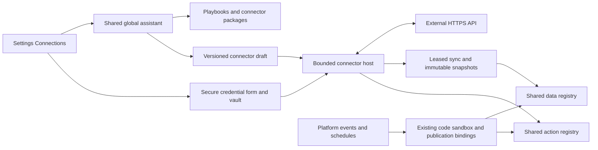

# External connections

Implemented October 5, 2026. This is the external service integration layer,
not the existing partner-organization `connections` domain. Its server namespace
is `integrations`; customers see **Settings → Connections**.

## Relationship to the platform

External accounts publish through the same data and action registries as internal
apps. Agents, document modules, calculations and scope programs consume normal
publication bindings. They do not receive credentials or an HTTP proxy.



The implementation is in `public/v1/integrations`. `api.ts` mounts at
`/v1/integrations`; `service.ts` owns accounts and execution; `publication.ts`
adapts them to the shared registries. The platform worker runs independent `integrations`, `integration-sync`
and `integration-descriptions` lanes. Sync rotates through due resources in bounded
batches so slow provider I/O cannot hold up event-driven automations. Single-host development uses the same
leased jobs through a local timer; web-only cluster hosts do not start it.

## Definition, installation and credentials are separate

- **Connector version:** immutable, content-addressed instructions for requests,
  transformations, schemas, resources, authentication and webhooks.
- **Connection:** one organization's account installation, owner, optional
  personal visibility, draft/active version, enabled operations and user grants.
- **Credentials:** encrypted account values, separate from every definition,
  package, publication, conversation and ordinary activity record.
- **Playbook:** reusable nonsecret instructions, aliases, domain and documentation
  URLs. It may exist without an executable connector.
- **Package:** a reusable versioned definition. Installation creates a new disabled
  connection without credentials, permissions or automations from the source.

The catalog combines product-supplied guidance with organization-owned playbooks
and packages. CompanyCam currently has guidance, not a shipped or verified
CompanyCam connector. Tenant-authored packages are not automatically shared with
other customers. Additional product connectors can be curated into the catalog;
no production QuickBooks/Gmail integration is claimed by this change.

Saving a draft never changes the active version. Activation uses optimistic
revisions and explicitly selected operations. Defaults resolve to the active
version, including after rollback. Pinned inactive versions fail closed; the host
never substitutes a different implementation. Pause disables reads and actions;
disconnect also removes stored credentials. Imported history remains retained.

## Flexible contracts

`contracts.ts` defines the authoring schema, also exposed to the assistant by
`connections_contract`. Request and response schemas can be `{}`. Add descriptions,
optional properties and validated fields when supported by real evidence. A
sample is an observation, not a guarantee. Unexpected fields can be preserved.
Invalid records fail the sync generation without replacing the last complete one.

Operations specify an effect, input/output schemas, request template and optional
bounded JavaScript transformations. `{{name}}` interpolates an input; an exact
placeholder preserves its JSON type. `requestCode` receives `inputs.input` and
`inputs.request`; response code receives `inputs.response`, `inputs.input` and
`inputs.status`. Both return `{outputs:{...}}`, following the existing module
runtime. Neither gets platform bindings, arbitrary networking or credentials.
Request code cannot change the declared HTTP method or destination origin.

Resources choose live lookup or synchronized records. Sync definitions provide
the items path, stable record ID, next-page cursor and optional incremental
checkpoint and deletion marker. Live reads are explicitly live and cannot promise
historical replay. Local snapshots support ordinary publication reads for small
datasets and paginated listing for larger datasets.

Example resource configuration:

```json
{
  "id": "projects",
  "title": "External projects",
  "operation": "listProjects",
  "mode": "sync",
  "itemsPath": "items",
  "idPath": "id",
  "cursorPath": "next",
  "cursorInput": "cursor",
  "syncMode": "incremental",
  "checkpointPath": "watermark",
  "checkpointInput": "since",
  "deletedPath": "deleted",
  "intervalSeconds": 300,
  "schema": {}
}
```

Pagination and incremental watermarks are distinct. The next run starts at the
last committed watermark; it does not reuse the exhausted next-page cursor.
Incremental updates copy the preceding generation, then upsert or tombstone IDs.
Snapshot imports replace the complete set. A connector-version change starts a
new import rather than mixing records produced by different mappings.

## Execution, caching and delivery

SQL storage uses the platform's SQLite/PostgreSQL abstraction. Records are indexed
by organization, connection, resource, generation and stable record ID. A worker
stages at most five pages per sync step, resumes unfinished imports, and publishes
the new head only after a complete successful import. Readers do not call the
external API for synchronized resources. Cursor pagination stays on its original
generation even if a new sync finishes mid-list.

Each completed revision records an outbox entry in the same transaction. The
worker emits `connection.resource.updated` with the connection, resource, new
revision and previous revision, then acknowledges that entry. Event idempotency
handles a crash between delivery and acknowledgement. Consumers can use this
event for materialization invalidation; this change does not rebuild Stats or add
its aggregation engine.

Transient sync failures keep the last complete generation. Automatic retries use
bounded exponential backoff, and Settings shows freshness and failures. Limits
include a 15-second HTTP request deadline, bounded response size, 5,000 records
per page, a million processed records per import and the existing code sandbox
budgets. Connectors must use paging or narrower queries when exceeding them.

External writes go through shared action receipts and a durable dispatch claim.
Repeated keys cannot repeat an effect or change the original input. A lost
response after dispatch is **uncertain** and is not automatically retried. A
provider idempotency header can be configured, but this does not imply universal
exactly-once delivery. Operators must reconcile uncertain external effects before
issuing a new operation.

Retained revisions currently have no automatic garbage collection. This preserves
frozen consumer evidence; any future retention policy must account for those
references before deleting snapshots. Initial sync limits and retained-generation
storage cost should be sized for the services actually connected.

## Automations and usage descriptions

Connection automations use the existing bounded document-module code runtime and
publication binding session. They receive `inputs.event`, `inputs.settings` and
private state. They may read declared data and invoke declared actions from
multiple internal apps and external connections. They run as their current author,
with fresh authorization, never as an unrestricted worker principal.

Triggers are organization events, optional project filters and conditions, or
interval schedules. Event delivery and schedule buckets have stable job identities.
Rules retain immutable authored versions. Editing or disabling a rule invalidates
queued jobs for its prior revision. Jobs for one rule serialize state updates;
uncertain runs retain receipts and do not automatically repeat.

Document modules, scope templates, instantiated work plans/nodes and organization
automation rules index declared external references when authored.
Settings lists those uses alongside connection-owned automations. Usage descriptions
are generated with the shared agent runtime, cached by source revisions, and may
group multiple rules into one explanation. Every underlying source ID must occur
exactly once. Grouping changes presentation only, never executable rules. Failed
or stale descriptions fall back to the exact source titles and descriptions.

This index follows declared bindings; it does not claim to infer every possible
relationship from arbitrary source code or historical ad-hoc reads.

## Assistant and Settings

Setup embeds `PlatformAssistant.mountSurface`, the shared global assistant
renderer/controller. Conversations retain agent ID `assistant`, the existing
model/settings/tools, user instructions and memory behavior. Each user has a
private `connection:<id>` conversation; new setup uses `connection:setup`.
Connection context augments the global instructions instead of introducing a
separate setup agent implementation.

The assistant first searches guidance/packages, can inspect public documentation,
author drafts, preview a declared read operation, request credentials, activate
selected operations, sync, author automations, pause, save packages and summarize
uses. Existing assistant action gates apply. The UI has Overview, Data,
Automations, Access, Activity and Setup views. Logos are attempted from the service
favicon, fall back to initials, and can be replaced with a customer upload.

Secure credential renders contain only an opaque request ID. The native form
fetches its field specification and posts directly to the authenticated credential
endpoint. Values are never put into a user message, assistant tool result or
conversation history. Requests are bound to user, organization, connection and
authentication destination/configuration, expire after ten minutes, and are
single-use. Replacing a destination/authentication configuration requires new
credentials. Changing ordinary nonsecret mappings does not.

## Authorization and network boundary

Management uses the existing `manage_company_settings` permission; the seven
production flags remain unchanged. Account owners and authorized organization
administrators manage organization connections. Personal connections remain
owner-controlled. Other users require explicit read/write grants for individual
enabled operations. Discovery, live reads, cached reads, frozen replay and action
invocation recheck access and the active version. Cross-tenant discovery does not
publish another organization's definitions.

Outbound traffic requires public HTTPS. The host resolves all destination
addresses, rejects private/local targets, pins the selected address for the
request, and refuses redirects. A test-only exact-origin bypass supports the dummy
API; there is no production private-network switch. Authentication is injected by
the host. Provider error bodies and raw request inputs are not stored in run logs.
Known credential values are redacted before response transformations and previews.

Authentication currently supports bearer/header tokens, Basic and OAuth authorization
code with PKCE. OAuth state is user-bound and single-use. Refresh is serialized;
an uncertain token rotation requires reconnection. Webhooks currently support
HMAC-SHA256 over raw JSON bytes, configured signature/ID/type paths, allowed event
names, deduplicated delivery and connection-specific event namespaces. They cannot
forge internal `document.signed` events.

Unusual authentication/signature protocols, binary protocols and private-network
services require a deliberate host adapter extension. Flexible payload typing does
not bypass these boundaries. Operation effects are an authored contract: actual
provider semantics still need verification before enabling them.

## Runtime configuration and verification

Production and cluster hosts require `CONNECTIONS_ENCRYPTION_KEY`, a base64-encoded
32-byte key shared by the application and relevant workers. Store it through the
deployment secret mechanism, never source control. AES-256-GCM binds encrypted
values to organization and connection. Missing configuration fails closed.
Single-host development may generate a local `.connections-key` under its platform
storage root. Key rotation requires an explicit re-encryption migration or account
reconnection; changing the key alone makes existing credentials unreadable.

OAuth also needs `CONNECTIONS_PUBLIC_ORIGIN` set to the public HTTPS portal origin
and the provider application configured with
`/v1/integrations/organizations/<orgId>/oauth/callback` as its redirect path.
The shared assistant needs its existing model configuration; no new model account
is introduced. Automatic descriptions use that runtime and its usage limits.

Run from `public/v1`:

```text
npm run check
npm run test:publication
npm run test:integrations
npm run test:integrations:ui
npm run test:integrations:postgres
```

The connection fixture starts a real local HTTP server with deliberately irregular
data, paging, failed pages, writes, dropped responses, OAuth token rotation and
signed webhooks. Model responses are scripted while exercising the real shared
assistant tool loop. Browser tests use the real Settings connection component and
assistant renderer at desktop/mobile widths. These tests do not certify live
provider onboarding or a live model's decisions; verify those with the intended
provider account before rollout. No deployment is part of this implementation.
